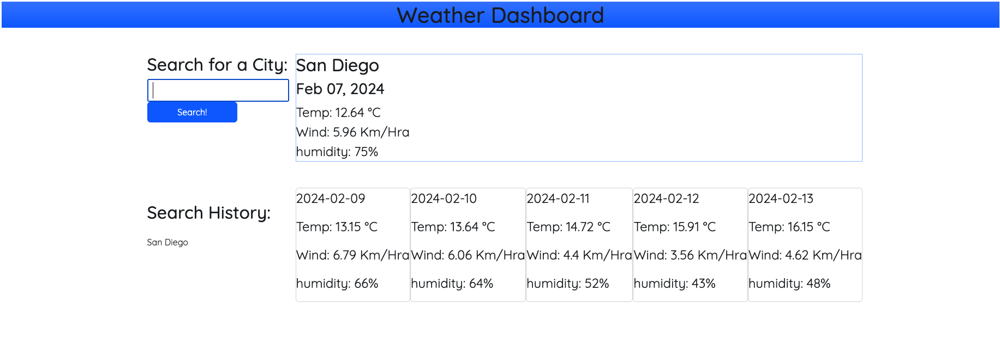

# WhateverWeather

Welcome to the Whatever Weather Website, feel free to search for all the cities you want.

## Features

- **Today weather ** Shows you the city you have searched 
- **5-day forecast:** Displays 5 day forecast

## Getting Started

1. Open the [Whatever Weather]().
2. Click on the text input and enter the city
3. You will see the city you searched for will go to history
4. Click on any historical event and you will see the weather for that city

## Example

## Technologies Used

- HTML
- CSS
- JavaScript
-Weather API
-Day JS

## Contributing

N/A

## License

This project is licensed under the [MIT License](LICENSE).

## Contact

If you have any questions, feedback, or issues, please reach out to us:

- Email: fernando.lage356@gmail.com
- GitHub: https://github.com/lage356

Thank you for using the legit daily planner! See you next Challenge
